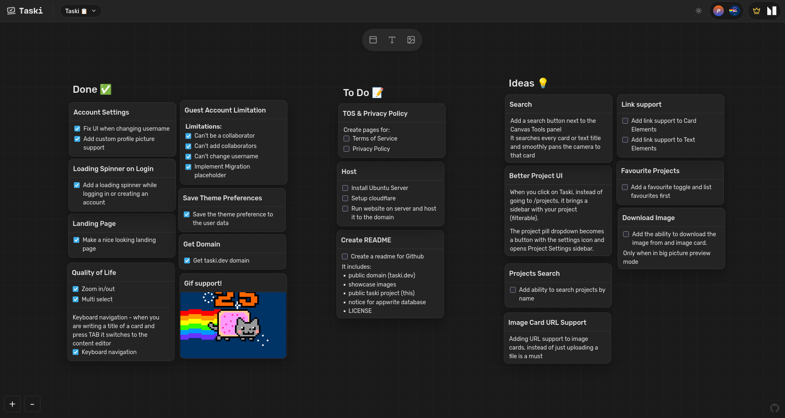

# Taski

> **A visual, collaborative workspace for organizing your tasks and ideas**

Taski is an infinite canvas task management tool designed for developers and creators who need flexibility and visual organization. Create cards, add notes, images, and collaborate in real-time.

🌐 **Live at:** [taski.dev](https://taski.dev)  
🗺️ **Live Roadmap & Active Tasks:** [Roadmap](https://taski.dev/project/69a096b3003b07e6a9c3)

---

## ✨ Features

- 🎨 **Infinite Canvas** - Pan, zoom, and organize your workspace freely
- 📝 **Rich Cards** - Text cards with markdown-style formatting (checkboxes, headings, bullets)
- 🖼️ **Image Cards** - Attach and preview images directly on your canvas
- 🔄 **Real-time Sync** - Collaborate with team members with live updates
- 🎯 **Multi-Select** - Select and move multiple elements at once
- 🎨 **Dark/Light Theme** - Built-in theme switcher
- 🔐 **OAuth Support** - GitHub and Google authentication
- ⌨️ **Keyboard Shortcuts**
  - `Ctrl/Cmd + A` - Select all
  - `Ctrl/Cmd + Scroll` - Zoom in/out
  - `Ctrl/Cmd + 0` - Reset zoom
  - `Delete/Backspace` - Delete selected elements
  - `Escape` - Clear selection
  - `Tab` - Move from title to content when editing cards

---



---

## 🚀 Getting Started

### Prerequisites

- Node.js 18+ and npm
- An [Appwrite](https://appwrite.io) instance (cloud or self-hosted)

### Installation

1. **Clone the repository**

```bash
git clone https://github.com/your-username/taski.git
cd taski
```

2. **Install dependencies**

```bash
npm install
```

3. **Set up Appwrite**

Create a new Appwrite project and set up the following:

**Database:** `taski`

**Tables:**

- **accounts**
  - `name` (string)
  - `isAnon` (boolean)
  - `avatarId` (string)
  - `theme` (string)

- **elements**
  - `title` (string)
  - `content` (string)
  - `projectId` (string)
  - `x` (double)
  - `y` (double)
  - `zIndex` (integer)
  - `type` (string)
  - `imageId` (string)

- **projects**
  - `name` (string)
  - `ownerId` (string)
  - `isPublic` (boolean)
  - `collabIds` (string array)
  - `requireLogin` (boolean)

**Storage:** Create a bucket for images

**Authentication:** Enable your preferred OAuth providers

4. **Configure environment variables**

Create a `.env` file in the root directory:

```env
VITE_APPWRITE_ENDPOINT=https://cloud.appwrite.io/v1
VITE_APPWRITE_PROJECT_ID=your-project-id
VITE_APPWRITE_IMAGES_BUCKET_ID=your-bucket-id
```

5. **Run the development server**

```bash
npm run dev
```

Open [http://localhost:5173](http://localhost:5173) in your browser.

### Build for Production

```bash
npm run build
```

The built files will be in the `dist` directory.

---

## 🤝 Contributing

Contributions are welcome! Please feel free to submit a Pull Request.

1. Fork the repository
2. Create your feature branch (`git checkout -b feature/AmazingFeature`)
3. Commit your changes (`git commit -m 'Add some AmazingFeature'`)
4. Push to the branch (`git push origin feature/AmazingFeature`)
5. Open a Pull Request

---

## 📝 License

This project is licensed under the MIT License - see the [LICENSE](LICENSE) file for details.

---

## 🙏 Acknowledgments

- Built with [React](https://react.dev)
- Backend powered by [Appwrite](https://appwrite.io)
- Icons by [Lucide](https://lucide.dev)

---

**Made with ❤️ for productive workflows**
